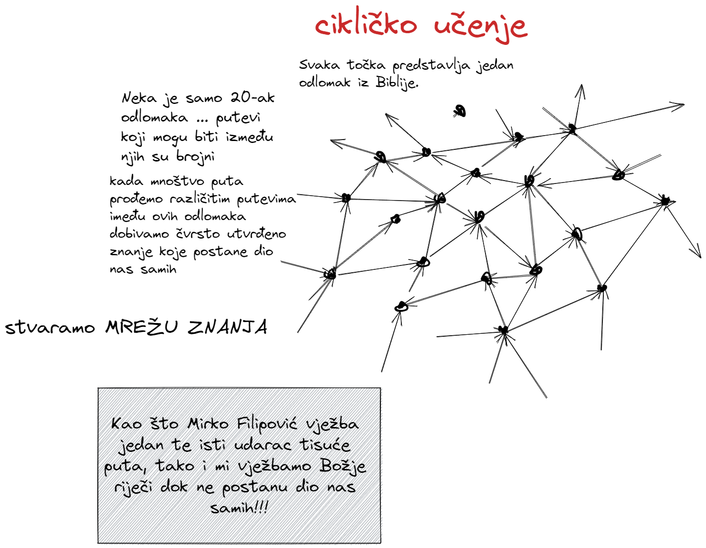

#  

<!--  ❗❗❗ 📝Kartice koje trebam ubaciti:
%%sve ovo trebam naći u karticama, ankiju, bilježnici i Obsidianu - clean writig vault%%
- što je evanđelje?
- što je tečaj evanđelja?
- Pavlovo jednostavno evanđelje
	- Što je uzor ovom siteu - ono što je radio sveti Pavao:
- o bodrenju: evanđelje nije solo sport, nego timski sport
- Crkva je mjesto gdje se predaje živa i djelotvorna Božja riječ
- isto tako Crkva 
-->

- [Napomene za polaznike](notes/000-Napomene-za-polaznike.md)
- [Što je potrebno za tečaj](notes/001-Što-je-potrebno-za-tečaj.md) 

---

- [Što je evanđelje](notes/002-Što-je-evanđelje.md)
- [Evanđelje je nadnaravno](notes/003-Evanđelje-je-nadnaravno.md)

---
- [Krvni savez](notes/010-Krvni-savez.md)
- [Božanska razmjena](notes/020-Božanska-razmjena.md)
- [Narav Božje riječi](notes/30-Narav-Bo%C5%BEje-rije%C4%8Di.md)
- [Vjera](notes/40-Vjera.md)
- [Preobrazba uma](notes/50-Preobrazba-uma.md)
-  